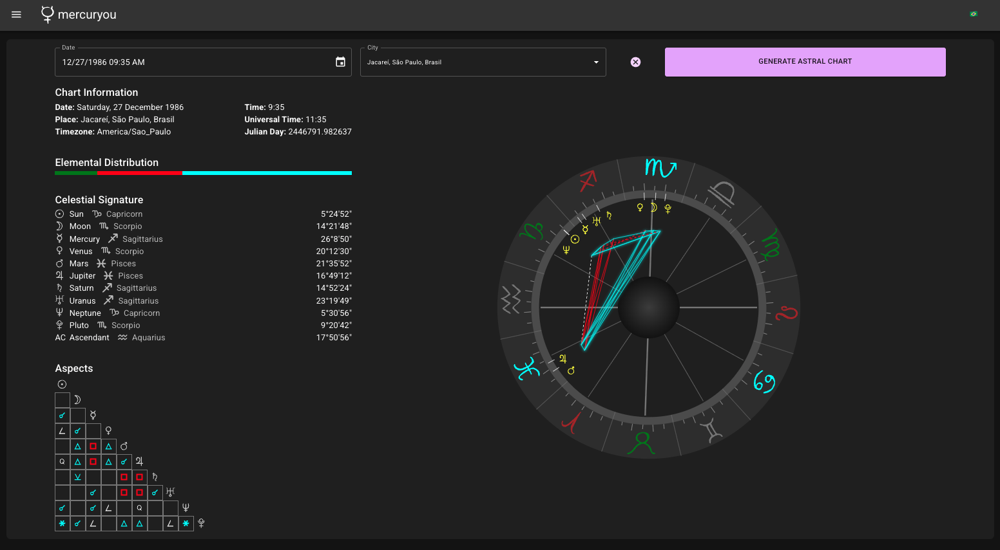

# ☿ mercurYou: Modern Astrology Chart Generator

> **Milenar Astrology - updated!**

---

## 📜 Overview

MercurYou is a side-project for generating astral charts in a prettier, nicer, and more modern way. It's also a showcase of my skills as a seasoned frontend developer 😉

---

## 🔑 Key Features

- 🚀 **Fast & Flexible:** Built using the latest techs available for blazing fast astral chart and sinastries (coming up!) generation
- 📦 **Extensible:** Several features to be included, roadmap TBD soon
- 🧑‍💻 **Developer Showoff:** Felt like poetry, right? You can hire me

---

## 🛠 Technologies Used

- **Frontend:** React, TypeScript, Material-UI, Next.js
- **State Management:** React Context
- **Testing:** Jest, React Testing Library
- **CI/CD:** GitHub Actions
- **Deployment:** TBD (likely on DigitalOCean)

---

## 🗂️ Table of Contents

### 🧠 Core

- [`/app`](./app/README.md) — App router structure, pages, and layouts
- [`/components`](./components/README.md) — Reusable UI blocks
- [`/features`](./features/README.md) — Domain-driven feature modules
- [`/context`](./context/README.md) — Global state via React Context

### 🔧 Logic

- [`/lib`](./lib/README.md) — Core logic, types, constants, helpers
- [`/hooks`](./hooks/README.md) — Custom React hooks

### 🧪 Testing

```
npm run test

```

---

## 🔧 Getting Started

A quick guide to get this thing up and running on your machine:

```bash
# 1. Clone the repo
git clone https://github.com/ploissken/neo-venus.git

# 2. Install dependencies
cd project-name
npm install

# 3. Run the app
npm run dev
```

---

## 📸 Visuals

Here’s a sneak peek of the app in action:



Live demo coming soon [here](https://google.com)

---

📨 Contact
You can reach me at ploissken at gmail or connect with me on [LinkedIn](https://www.linkedin.com/in/rodrigo-souza-97302724/).
